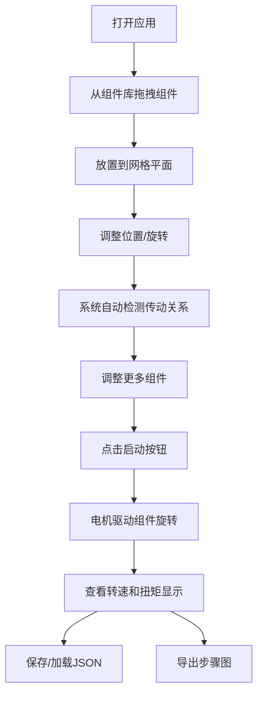

## 1. 产品概述
基于Three.js的3D可编程"乐高式"机械传动系统，允许用户通过拖拽组件搭建机械结构，模拟真实的齿轮传动、皮带传动等物理效果。
- 主要用途：教育演示、机械设计原型验证、创意搭建
- 目标用户：机械爱好者、学生、工程师、教育工作者
- 产品价值：降低机械原理学习门槛，提供交互式3D可视化体验

## 2. 核心功能

### 2.1 用户角色
| 角色 | 注册方式 | 核心权限 |
|------|---------|---------|
| 普通用户 | 无需注册 | 搭建机械结构、运行模拟、保存/加载、导出图片 |

### 2.2 功能模块
1. **3D场景主界面**：网格平面、组件库面板、工具栏、信息面板
2. **组件库**：齿轮（多齿数）、传动轴、皮带轮、电机
3. **交互操作**：拖拽放置、移动、旋转、删除
4. **传动检测**：齿轮啮合检测、皮带连接检测
5. **运动模拟**：电机驱动、转速比计算、方向传递
6. **数据可视化**：转速显示、扭矩方向箭头
7. **数据持久化**：JSON保存/加载
8. **导出功能**：步骤图导出
9. **碰撞检测**：防止组件重叠
10. **视图切换**：工程图纸背景、透明背景、爆炸视图
11. **传动链高亮**：点击齿轮高亮整个传动链

### 2.3 页面详情
| 页面名称 | 模块名称 | 功能描述 |
|----------|---------|----------|
| 主界面 | 3D场景区 | 显示网格平面，支持组件放置和交互操作 |
| 主界面 | 左侧组件库 | 展示可拖拽的机械组件列表 |
| 主界面 | 顶部工具栏 | 启动/停止、保存/加载、导出、视图切换 |
| 主界面 | 右侧信息面板 | 显示选中组件信息、转速、参数 |
| 主界面 | 底部状态栏 | 显示当前选中状态提示 |

## 3. 核心流程
用户从左侧组件库拖拽组件到3D场景中的网格平面上，通过移动和旋转调整位置，系统自动检测齿轮啮合和皮带连接关系。点击启动按钮后，电机按照传动关系驱动所有连接组件旋转。用户可保存搭建完成的结构为JSON文件，或导出步骤图展示搭建过程。

## 4. 用户界面设计

### 4.1 设计风格
- 主色调：科技蓝色系（#1e40af 深蓝 / #3b82f6 蓝）
- 辅助色：橙色（#f97316）用于高亮和警告
- 中性色：深灰(#1f2937) / 中灰(#6b7280) / 浅灰(#f3f4f6)
- 按钮风格：圆角立体按钮，带微阴影，hover时上浮效果
- 字体：JetBrains Mono（等宽字体用于技术感，搭配思源黑体
- 布局：卡片式布局，左侧组件库 + 中央3D场景 + 右侧信息面板
- 图标风格：Lucide线性图标

### 4.2 页面设计概览
| 页面名称 | 模块名称 | UI元素 |
|----------|---------|---------|
| 主界面 | 组件库 | 卡片式组件预览图、hover放大效果、拖拽光标 |
| 主界面 | 3D场景 | 网格辅助线、选中高亮边框、坐标轴指示器 |
| 主界面 | 工具栏 | 图标按钮组、分割线、功能分组 |
| 主界面 | 信息面板 | 参数表格、实时数据显示、颜色编码状态 |

### 4.3 响应式
桌面端优先设计，最小支持1280px宽度。组件库和信息面板可折叠。

### 4.4 3D场景指引
- 环境：默认深色背景配柔和环境光+方向光
- 光照：AmbientLight(0xffffff, 0.6) + DirectionalLight(0xffffff, 0.8) 带阴影
- 相机：PerspectiveCamera，fov=50，支持OrbitControls轨道控制
- 构图：居中展示，组件放置区域位于场景中心
- 交互：拖拽组件、滚轮缩放、右键平移、左键旋转视角
- 后处理：FXAA抗锯齿、Bloom发光效果用于高亮
- 性能：单页应用，组件使用InstancedMesh优化性能
