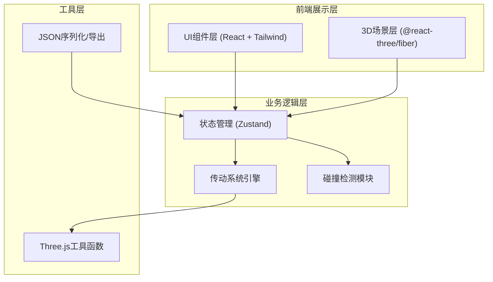
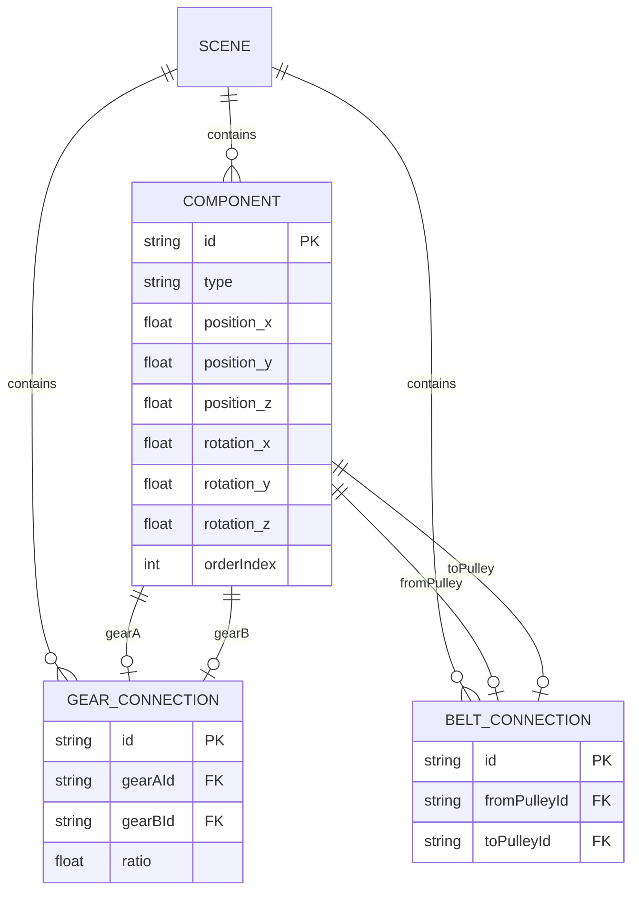

## 1. 架构设计



## 2. 技术描述
- 前端框架: React@18 + TypeScript
- 构建工具: Vite
- 样式方案: TailwindCSS@3
- 3D渲染: three + @react-three/fiber + @react-three/drei + @react-three/postprocessing
- 状态管理: zustand
- 图标库: lucide-react
- 后端: None（纯前端应用）
- 数据库: LocalStorage（可选）

## 3. 路由定义
| 路由 | 用途 |
|------|------|
| / | 主应用界面（3D场景 + 工具栏 + 组件库 + 信息面板）|

## 4. 数据模型

### 4.1 组件数据结构

```typescript
// 组件类型枚举
enum ComponentType {
  GEAR = 'gear',
  SHAFT = 'shaft',
  PULLEY = 'pulley',
  MOTOR = 'motor',
  BELT = 'belt'
}

// 基础组件接口
interface BaseComponent {
  id: string;
  type: ComponentType;
  position: { x: number; y: number; z: number };
  rotation: { x: number; y: number; z: number };
  scale: { x: number; y: number; z: number };
  name: string;
  orderIndex: number; // 放置顺序
}

// 齿轮
interface GearComponent extends BaseComponent {
  type: ComponentType.GEAR;
  teeth: number; // 齿数
  radius: number;
  currentSpeed: number; // 当前转速
  direction: 1 | -1; // 旋转方向
}

// 传动轴
interface ShaftComponent extends BaseComponent {
  type: ComponentType.SHAFT;
  length: number;
  radius: number;
}

// 皮带轮
interface PulleyComponent extends BaseComponent {
  type: ComponentType.PULLEY;
  radius: number;
  currentSpeed: number;
  direction: 1 | -1;
}

// 电机
interface MotorComponent extends BaseComponent {
  type: ComponentType.MOTOR;
  speed: number; // 设定转速 (RPM)
  direction: 1 | -1;
  running: boolean;
}

// 皮带连接
interface BeltConnection {
  id: string;
  fromPulleyId: string;
  toPulleyId: string;
}

// 齿轮啮合连接
interface GearConnection {
  id: string;
  gearAId: string;
  gearBId: string;
  ratio: number; // 传动比
}

// 完整场景状态
interface SceneState {
  components: BaseComponent[];
  gearConnections: GearConnection[];
  beltConnections: BeltConnection[];
  isRunning: boolean;
  selectedComponentId: string | null;
  highlightedChain: string[];
  background: 'dark' | 'blueprint' | 'transparent';
  explosionView: boolean;
  explosionFactor: number;
}
```

### 4.2 数据模型ER图



## 5. 模块划分

### 5.1 核心模块
| 模块路径 | 职责 |
|---------|------|
| src/store/useSceneStore.ts | Zustand状态管理，场景全局状态 |
| src/engine/TransmissionEngine.ts | 传动系统计算引擎，转速比、方向传递 |
| src/engine/CollisionDetector.ts | 碰撞检测模块 |
| src/engine/ConnectionDetector.ts | 齿轮啮合/皮带连接自动检测 |

### 5.2 3D组件模块
| 模块路径 | 职责 |
|---------|------|
| src/components/three/Gear3D.tsx | 齿轮3D渲染组件 |
| src/components/three/Shaft3D.tsx | 传动轴3D渲染组件 |
| src/components/three/Pulley3D.tsx | 皮带轮3D渲染组件 |
| src/components/three/Motor3D.tsx | 电机3D渲染组件 |
| src/components/three/Belt3D.tsx | 皮带3D渲染组件 |
| src/components/three/GridFloor.tsx | 网格地板组件 |
| src/components/three/SpeedLabel.tsx | 转速标签组件 |
| src/components/three/TorqueArrow.tsx | 扭矩方向箭头 |

### 5.3 UI组件模块
| 模块路径 | 职责 |
|---------|------|
| src/components/ui/ComponentLibrary.tsx | 左侧组件库面板 |
| src/components/ui/Toolbar.tsx | 顶部工具栏 |
| src/components/ui/InfoPanel.tsx | 右侧信息面板 |
| src/components/ui/StatusBar.tsx | 底部状态栏 |

### 5.4 工具函数模块
| 模块路径 | 职责 |
|---------|------|
| src/utils/geometry.ts | 几何计算工具函数 |
| src/utils/exportUtils.ts | JSON导出/导入、图片导出 |
| src/utils/idGenerator.ts | ID生成器 |

## 6. 核心算法说明

### 6.1 齿轮啮合检测算法
1. 计算两个齿轮中心距离
2. 计算两齿轮半径之和
3. 若距离 ≈ 半径之和（容差范围内），则判定为啮合
4. 计算传动比 = 主动轮齿数 / 从动轮齿数
5. 从动轮方向 = 主动轮方向取反

### 6.2 传动链传播算法
1. 从电机节点出发进行BFS/DFS遍历
2. 沿齿轮啮合和皮带连接关系传播转速和方向
3. 皮带传动：方向相同，传动比 = 半径反比
4. 齿轮传动：方向相反，传动比 = 齿数反比
5. 使用访问标记避免循环传动

### 6.3 碰撞检测算法
1. 使用AABB包围盒进行粗检测
2. 对接近的组件使用精确几何体碰撞检测
3. 拖拽时实时检测，若碰撞则阻止放置或高亮警告

## 7. 第三方依赖说明
| 依赖包 | 用途 |
|--------|------|
| three | WebGL 3D渲染核心库 |
| @react-three/fiber | Three.js的React渲染器 |
| @react-three/drei | Three.js常用辅助组件 |
| @react-three/postprocessing | 后处理效果（抗锯齿、发光）|
| zustand | 轻量级状态管理 |
| lucide-react | 图标库 |
| tailwindcss@3 | CSS工具类框架 |
